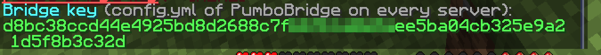

<p align="center">
  
</p>

<h1 align="center">PumboBridge</h1>

<p align="center">The server half of PumboProx: it lets the proxy act inside your Pumpkin servers.</p>

<p align="center">
  <a href="LICENSE"></a>
  
  
  <a href="https://github.com/Pumpkin-MC/Pumpkin"></a>
  <a href="https://github.com/Pumpkin-MC/Pumpkin"></a>
  <a href="https://github.com/PumboMC/PumboProx"></a>
  
</p>

<p align="center">
  <a href="#features">Features</a> ·
  <a href="#two-builds">Two builds</a> ·
  <a href="#installation">Installation</a> ·
  <a href="#configuration">Configuration</a> ·
  <a href="#commands-and-permissions">Commands</a> ·
  <a href="#building">Building</a>
</p>

---

<p align="center">
  <a href="https://github.com/PumboMC/PumboProx"></a>
</p>

<p align="center"><b>Running more than one server?</b> <a href="https://github.com/PumboMC/PumboProx">PumboProx</a> is the proxy for Pumpkin networks, with plugins in WebAssembly.<br>PumboBridge is its server half: it connects each Pumpkin server to the proxy.</p>

> [!NOTE]
> PumboBridge is in **beta** (0.1.1-beta). Try it on a test network before you put players on it.

## What it does

PumboBridge connects each Pumpkin server to your PumboProx proxy. The proxy moves players between servers on its own. The bridge lets it and its plugins act inside a server as well: teleport players within the world, change game modes, heal, read and change inventories, and ask about players and the server. It also brings the proxy's ranks to every server. The bridge has no commands of its own and keeps no player data: it only does what the proxy asks.

## Features

| | Feature | |
| --- | --- | --- |
| 📍 | **Teleport** | Move players on any server. A teleport waits until the client confirmed the previous one, so nobody gets kicked with "Wrong teleport id". |
| 🎮 | **Game mode** | Change a player's game mode from the proxy. |
| ❤️ | **Heal** | Restore a player's health. |
| 🧪 | **Effects** | Add or remove status effects. |
| 🕊️ | **Flight** | Let a player fly, and set the flying speed. |
| 🎒 | **Inventory** | Read, set, give and clear items, and open a read-only chest view of items for a player. |
| ➡️ | **Send to a server** | Move a player to a server and run the actions after they arrive. |
| 🏅 | **Ranks** | The proxy's `permissions.yml` decides the permissions on every server, with server and server group contexts. |
| 🔣 | **Placeholders** | `%server_tps:<server>%`, `%server_mspt:<server>%`, `%player_health%`, `%player_food%`, `%player_level%`, `%player_world%`, `%player_gamemode%`. |
| 🔗 | **Pairing** | The same file and config on every server. The bridge finds out by itself which server it is. |
| ✍️ | **Signed** | Every message is signed with the bridge key and numbered, so it cannot be faked or replayed. |
| 🔄 | **Reconnect** | When the proxy restarts, the bridge connects again by itself after 1, 2, 5, 10 and then every 30 seconds. |
| 📊 | **Status** | `/pumbo bridge` lists every server with the state of its bridge, versions, ping and since when it is connected. |

## Two builds

PumboBridge has two halves. The proxy half is built into PumboProx, so there is only one file to install.

| Half | File | Where it goes | What it does |
| --- | --- | --- | --- |
| 🎃 **Server plugin** | `PumboBridge-Pumpkin-26.3-<version>.wasm` or `PumboBridge-Pumpkin-26.2-<version>.wasm` | `plugins/` of every Pumpkin server | Connects to the proxy and runs what it asks on this server. |
| 🌐 **Proxy side** | built into PumboProx | `bridge:` in `pumboprox.yml` | Accepts the bridges, signs the connection and offers the `pumbo:bridge` service to proxy plugins. |

A new Pumpkin version needs only a new build of the bridge. A new Minecraft version for players changes only the proxy.

## Installation

> [!TIP]
> Download the files from [Releases](https://github.com/PumboMC/PumboBridge/releases/latest), or [build from source](#building).

1. **Proxy.** Turn the bridge on in `pumboprox.yml` and restart the proxy:

   ```yaml
   bridge:
     enabled: true
     listen: "127.0.0.1:25578"     # where bridges connect
     trusted-plugins: [pumbo-core]  # proxy plugins that may send commands
   ```

   The proxy creates `bridge.key`. Type `bridge key` in the proxy console to see it. Players with `pumbo.proxy.bridge.key` see it with `/pumbo bridge key`:

   

2. **Each server.** Put the file that matches your Pumpkin version into `plugins/` and start the server once. It creates `plugins/data/pumbobridge/config.yml`. Put the proxy's address and the key there and restart the server.

3. **Pumpkin's plugin sandbox.** The bridge needs `network.tcp.connect`, `fs.read.data` and `fs.write.data`. Pumpkin asks about them in the console on the first start. To approve them in advance, add them to `allowed_permissions` in `[plugins]` of `pumpkin.toml`.

4. **Check.** `/pumbo bridge` in the proxy lists every server and its bridge.

   

The connection is signed, not encrypted, like Velocity forwarding. Keep it on `127.0.0.1`, a private network or a tunnel (WireGuard, Tailscale). The bridge warns when the proxy address is public.

## Configuration

The config file is written on the first start, with comments. It is the same on every server. Changes need a server restart.

| Option | Default | What it does |
| --- | --- | --- |
| `proxy` | `127.0.0.1:25578` | Address and port of `bridge.listen` in `pumboprox.yml` (IPv4, no host names). |
| `key` | empty | The bridge key from the proxy. While it is empty, the bridge stays idle. |

On the proxy, the `bridge:` section of `pumboprox.yml`:

| Option | Default | What it does |
| --- | --- | --- |
| `enabled` | `false` | Turn the bridge on. |
| `listen` | `127.0.0.1:25578` | Where the bridges connect. |
| `key-file` | `bridge.key` | The file with the bridge key. |
| `trusted-plugins` | `[pumbo-core]` | Proxy plugins that may send commands. Every plugin may ask questions. |
| `command-timeout-ms` | `5000` | How long the proxy waits for an answer. |

## Commands and permissions

The bridge has no commands on the server. On the proxy:

| Command | What it does | Permission |
| --- | --- | --- |
| `/pumbo bridge` | Every server with the state of its bridge | `pumbo.proxy.bridge` |
| `/pumbo bridge key` | Show the bridge key | `pumbo.proxy.bridge.key` |

In the proxy console the same commands are `bridge` and `bridge key`.

## Works with other Pumbo plugins

PumboBridge needs [PumboProx](https://github.com/PumboMC/PumboProx). Without a key it stays idle and changes nothing on the server.

| Plugin | Together |
| --- | --- |
| 🌐 [PumboProx](https://github.com/PumboMC/PumboProx) | Proxy plugins use the `pumbo:bridge@1.0` service. Only `trusted-plugins` may send commands, every plugin may ask questions. They also get events (join, leave, death, respawn, world change). |
| 👥 [PumboPerms](https://github.com/PumboMC/PumboPerms) | When PumboPerms is on a server, it imports the proxy's ranks once and writes permissions alone. The bridge stops writing them. When PumboPerms is removed, the bridge takes over again. |
| 🏰 PumboGuard (planned) | Will send its region rules to the servers through the bridge. |

Not in this version: `kill`, console commands, and enchantments or exact item components in inventory calls (items carry their id, count, name and lore).

## Building

You need Rust stable with the WebAssembly target:

```sh
rustup target add wasm32-wasip2
```

Cargo fetches the bridge protocol (`pumbo-bridge-proto`) and `pumbo-common` from the [PumboProx](https://github.com/PumboMC/PumboProx) repository on the first build.

Both versions (`dist/PumboBridge-26.3.wasm` and `dist/PumboBridge-26.2.wasm`):

```sh
plugins/pumbo-bridge-pumpkin/build.sh
```

Tests:

```sh
cargo test
```

## License

PumboBridge is licensed under the [GNU General Public License v3.0](LICENSE). The bridge protocol (`pumbo-bridge-proto`, part of PumboProx) and the shared library for Pumbo plugins are dual-licensed under MIT and Apache-2.0.

PumboBridge is not affiliated with Mojang, Microsoft or the Pumpkin project.

---

<p align="center">
  Part of <a href="https://github.com/PumboMC/PumboProx"><b>PumboProx</b></a>. Everything you need to run a network on Pumpkin.
</p>
